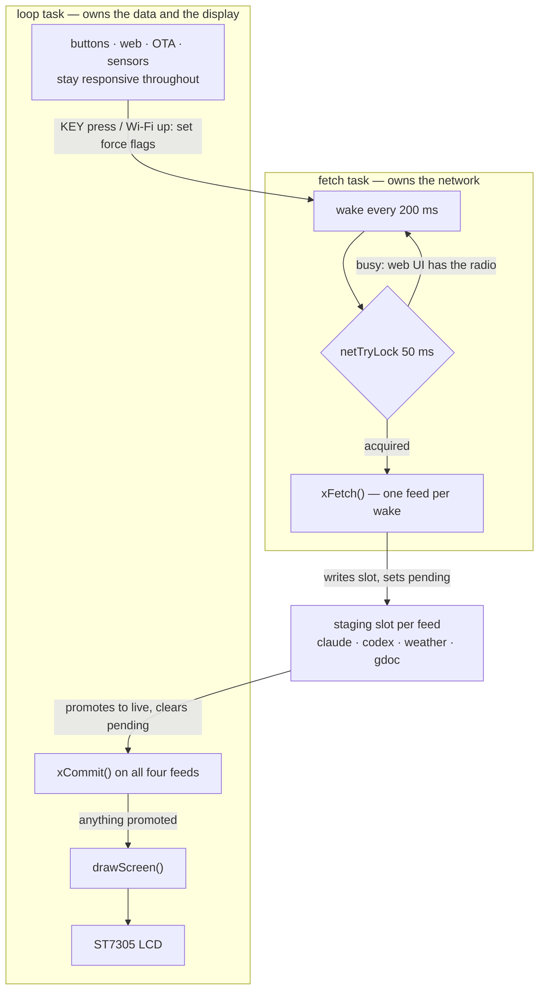
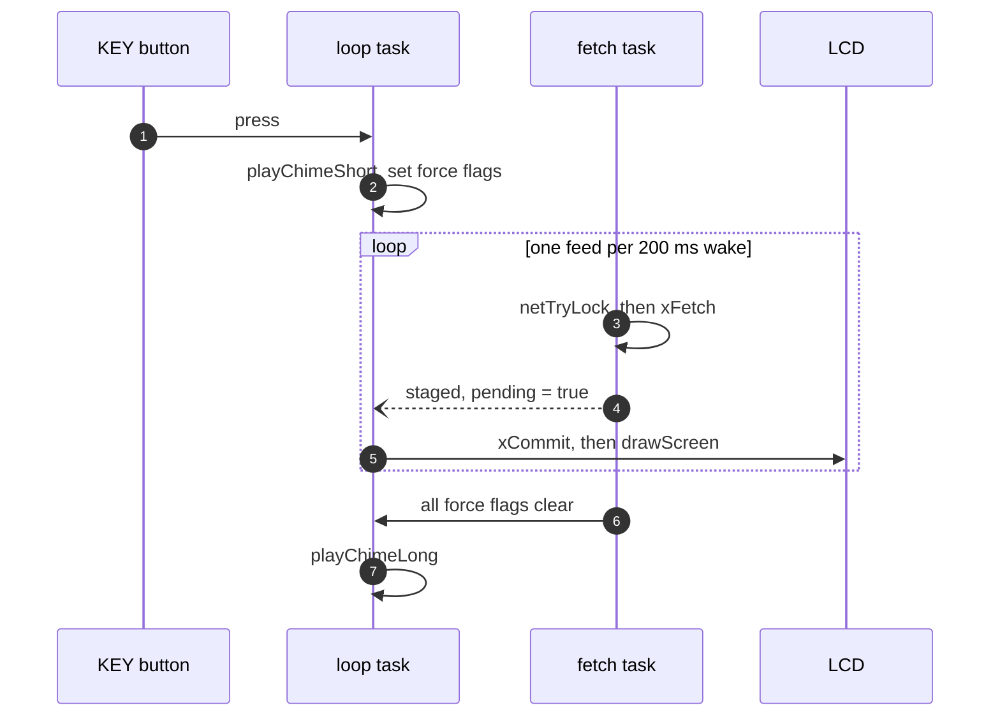

# hd-esp32-s3

Arduino (Arduino-ESP32) firmware for an **ESP32-S3** desktop weather/clock device. It reads
temperature/humidity from an SHTC3 sensor, fetches weather from Open-Meteo over HTTPS, renders to a
300×400 ST7305 reflective monochrome LCD via U8g2, and plays a chime through an ES8311 codec. A LAN
web UI (port 80) exposes settings and history charts.

## Required Arduino libraries

These are **not** vendored in the repo and must be installed through the Arduino IDE Library Manager
(or `arduino-cli lib install`). Everything else used by the sketch either ships with the
**Arduino-ESP32** core (`WiFi`, `WiFiClientSecure`, `HTTPClient`, `WebServer`, `ESPmDNS`, `SPI`,
`driver/*`, `esp_*`, FreeRTOS, SD/MMC) or is vendored under `src/ExternLib/` (`esp_codec_dev`,
`codec_board`).

| Library | Provides / used for | Header |
|---------|--------------------|--------|
| **U8g2** | Monochrome graphics + the custom ST7305 panel driver | `U8g2lib.h` |
| **ArduinoJson** | Parsing Open-Meteo / claude.ai / weather JSON responses | `ArduinoJson.h` |
| **SensorLib** | PCF85063 RTC support | `SensorPCF85063.hpp` |

Install via CLI:

```bash
arduino-cli lib install "U8g2" "ArduinoJson" "SensorLib"
```

Or in the Arduino IDE: **Tools → Manage Libraries…**, then search for and install each of the three above.

You also need the **ESP32 board package** (`esp32:esp32`) installed via the Boards Manager.

## Build / flash

Please follow [official doc](https://docs.waveshare.com/ESP32-Arduino-Tutorials/Arduino-IDE-Setup) to setup IDE.

Plain Arduino sketch — build with `arduino-cli` or the Arduino IDE (not PlatformIO/idf.py). The
sketch folder name must match the `.ino`: `hd-esp32-s3.ino` inside `hd-esp32-s3/`.

Target board is ESP32-S3. **PSRAM must be enabled** (the codec echo task allocates from SPIRAM). The
board has 16 MB flash, so use a 16 MB partition scheme with a 3 MB app partition — the default scheme
only gives ~1.25 MB of app space, which the firmware nearly fills.

```bash
FQBN=esp32:esp32:esp32s3:PSRAM=enabled,FlashSize=16M,PartitionScheme=app3M_fat9M_16MB
arduino-cli compile --fqbn "$FQBN" .
arduino-cli upload  --fqbn "$FQBN" -p /dev/ttyACM0 .
arduino-cli monitor -p /dev/ttyACM0 -c baudrate=115200   # Serial logs are 115200
```

## Codex usage relay

The Claude usage panel authenticates with a session cookie you paste once. Codex can't work that
way: its ChatGPT access token is minted by the `codex` CLI and expires after ~10 days, and the only
thing that can refresh it is a logged-in Codex install. So the machine you run Codex on **relays**
the token to the device, and the ESP32 fetches its own usage with it
(`GET chatgpt.com/backend-api/wham/usage`).

Every ordinary `codex` invocation re-mints the token for another 10 days, so an hourly relay keeps
the device current with no manual step — and because the token stays valid for 10 days, the panel
survives your machine being off for over a week.

Configure (needs `curl` and `jq`; replace `esp32` if you changed the mDNS hostname):

```bash
(crontab -l 2>/dev/null; echo '0 * * * * curl -sf -X POST -d token=$(jq -r .tokens.access_token $HOME/.codex/auth.json) http://esp32.local/codextoken') | crontab -
```

De-configure:

```bash
crontab -l | grep -v codextoken | crontab -
```

The single quotes matter: `$(...)` must be evaluated by cron at run time, not when the line is
installed. Cron runs the job under `/bin/sh`, so the command deliberately avoids bash-isms.

Without the cron job the panel still works — paste the token into **Configuration → Codex usage** in
the web UI (it's `tokens.access_token` in `~/.codex/auth.json`) and re-paste it every ~10 days. Whenever
there is no usable token the device points back here: the LCD shows `no access token relayed yet`
(or `access token expired`) above `see README: Codex usage relay`, the web card raises a warning
naming this section, and the serial log says the same at boot. The web card also shows the exact
expiry date, read from the token itself.

Note the reported windows depend on your plan — a Plus account currently returns a single 7-day
window and no secondary one, so only one gauge is drawn.

See `CLAUDE.md` for architecture, the module/BSP layout, the pin map, and the list of persisted
SD-card files.

## How it runs

Network feeds are fetched on their own FreeRTOS task so a refresh never parks the UI. The two tasks
share no mutable data: the fetch task writes a private staging slot per feed, and the loop task
promotes it. Every value the renderer reads is therefore written by the thread that reads it, which
is why there is no lock around the display or the cached feed values.



The only thing the two tasks still share is the **network lock**, which serialises TLS: two
`WiFiClientSecure` contexts alive at once exhaust the heap. The web UI opens its own connections on
the loop task (listing GitHub releases), so the lock is taken asymmetrically — background
polling tries for 50 ms and retries on its next wake, while anything you triggered waits for the
radio. Interactive work never queues behind a background refresh. The same lock guards the settings
the fetch task reads (the doc URL, credentials, city coordinates) against the web handlers that
write them.

A KEY press is a request, not a blocking call. The screen fills in one feed at a time as results
land, rather than all at once when the last fetch returns:



Pressing KEY again mid-refresh **coalesces** rather than queueing: the force flags are booleans, so a
second press re-arms all four feeds and extends the round in progress. Ten presses cost one long
round, not ten rounds — though each press does re-fetch feeds that already completed.

## Continuous integration

`.github/workflows/firmware.yml` builds the image on every push to `main` and on pull requests, pinned to the
same core and library versions used locally (ESP32 core 3.3.11, U8g2 2.36.19, ArduinoJson 7.4.3, SensorLib
0.4.1). Each run uploads `hd-esp32-s3.ino.bin` plus its SHA-256 as a workflow artifact, kept 90 days.

**Pushing a `v*` tag also publishes the `.bin` as a GitHub Release asset**, which is what a device polls for
over-the-air self-updates:

```bash
git tag v0.1.0 && git push origin v0.1.0
```

Only tags publish releases. A routine commit to `main` produces a downloadable artifact but never becomes an
update candidate, so merging cannot flash every device on its own.

Builds are stamped with `-DFW_VERSION` (see `src/version/version.h`): a tag builds as the tag, other builds as
`main-<short sha>`, and a local build reports `dev`. The running firmware logs its version at boot.

## License

MIT — see [LICENSE](LICENSE). Every project source file carries an `SPDX-License-Identifier: MIT` header.

Two exceptions, both left unstamped because they are not this project's to license:

- **`src/ExternLib/`** — Espressif's `esp_codec_dev` and `codec_board` components, vendored for the Arduino
  build and licensed Apache-2.0 by their authors.
- **`src/Music/canon.h`** — a generated PCM byte array of Canon in D.

The two usage-panel icons (`clawd_icon.h`, `codex_icon.h`) are 1-bit renderings of the Claude and OpenAI
marks, used to label whose quota each gauge shows. The MIT grant covers them as code; the marks belong to
Anthropic and OpenAI respectively.
