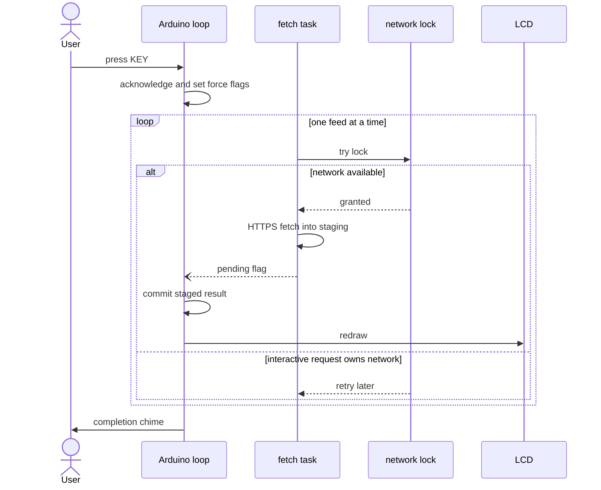

# Firmware architecture

The Arduino `loop()` owns hardware sampling, rendering, web request handling, button handling, OTA,
and all state read by the LCD. A background FreeRTOS task performs scheduled and requested network
feed fetches so an HTTPS round trip does not freeze those foreground duties.

## Feed handoff

Each feed is split into `xFetch()` and `xCommit()`:

1. The fetch task writes a private staging value.
2. It publishes a small atomic pending flag.
3. The loop task calls `xCommit()`, promotes the staged value, and redraws the display.

The producer does not replace a staged value while it is pending. This keeps the renderer on one task
and avoids a general data mutex, including for Google Doc strings whose interior pointers are used
during drawing.

## Network serialization

TLS requests are intentionally sequential. Two live `WiFiClientSecure` contexts can exhaust the
ESP32's available heap.

- Background polling uses `netTryLock()` and retries later when the network is busy.
- User-triggered web work uses `netLock()` and waits for its turn.
- The same lock protects feed settings while web handlers change them.

The fetch task runs at most one due or forced feed per wake and releases the network lock between
feeds. The display can therefore update one feed at a time while buttons, web requests, and OTA remain
responsive.

Repeated refresh requests coalesce through boolean force flags rather than forming an unbounded queue.
A KEY press arms the completion chime; scheduled refreshes, startup fetches, and Wi-Fi reconnect
refreshes remain silent.

## Source layout

`hd-esp32-s3.ino` contains `setup()`, `loop()`, the screen compositor, buttons, and chimes. Backend
features live in folders under `src/`; Arduino recursively compiles that directory. Hand-written board
drivers are in `src/bsp/`, while `src/ExternLib/` contains vendored Espressif codec components and must
not be edited as project source.

For the module inventory, pin map, persistence details, and BSP conventions, see
[CLAUDE.md](../CLAUDE.md).
